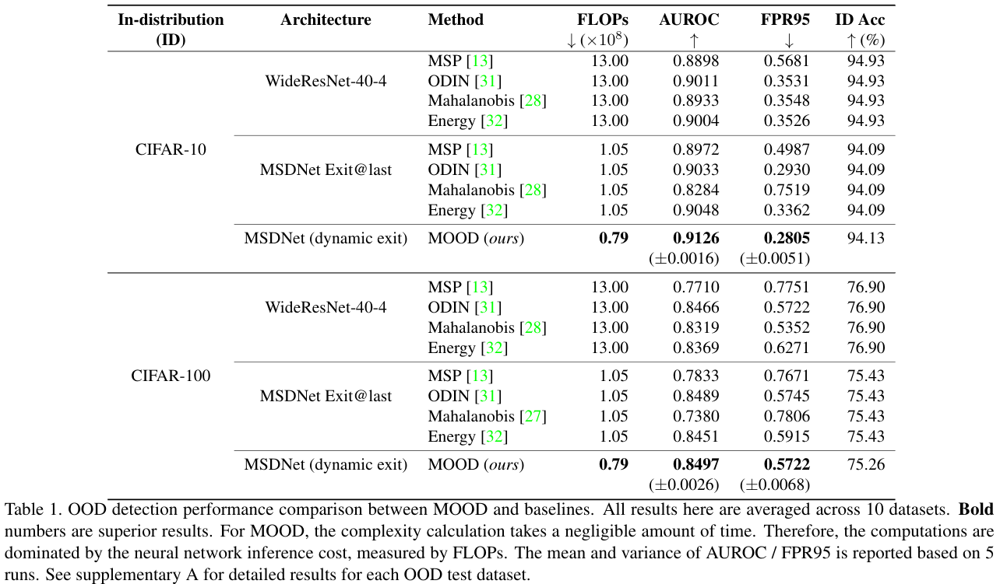

# MOOD: Multi-level Out-of-distribution Detection

This is a [PyTorch](http://pytorch.org) implementation for detecting out-of-distribution examples in neural networks. The method is described in the paper [MOOD: Multi-level Out-of-distribution Detection](https://arxiv.org/???) by Ziqian Lin*, Sreya Dutta Roy* and Yixuan Li (*Authors contributed equally.). We propose a novel framework, multi-level out-of-distribution detection (MOOD), which exploits intermediate classifier outputs for dynamic and efficient OOD inference, where easy OOD examples can be effectively detected early without propagating to deeper layers.
<p align="center">

</p>
The method achieves up to 71.05% computational reduction in inference, while maintaining competitive OOD detection performance.
<p align="center">

</p>
<p align="center">

</p>

## Experimental Results

We used the deep learning model [MSDNet](https://openaccess.thecvf.com/content_ICCV_2019/papers/Li_Improved_Techniques_for_Training_Adaptive_Deep_Networks_ICCV_2019_paper.pdf) with for our experiment. The PyTorch implementation of [MSDNet](https://github.com/kalviny/IMTA) is provided by [Hao Li](https://github.com/andreasveit/densenet-pytorch).
The experimental results are shown as follows. The definition of each metric can be found in the [paper](https://arxiv.org/???).



## Pre-trained Models

We provide two pre-trained neural networks: The two [MSDNet](https://drive.google.com/drive/folders/1IRHsD-JRuJP8jUGt0qfFI19-545b3vTd?usp=sharing) networks trained on  CIFAR-10 and CIFAR-100 respectively, please put the unzipped files in the folder '/trained_model'. The test accuracies are given by:

Architecture    |  CIFAR-10   | CIFAR-100
------------    |  ---------  | ---------
MSDNet          |  94.09      | 75.43

## Dataset

### Description
We use CIFAR-10 and CIFAR-100 as in-distribution datasets, which are common benchmarks for OOD detection. For the OOD detection evaluation, we consider  a total of 10 datasets with a diverse spectrum of image complexity. In order of increasing complexity, we use MNIST, K-MNIST, fashion-MNIST, LSUN (crop), SVHN, Textures, STL10, Places365, iSUN and LSUN (resize). All images are resized to 32×32 before feeding into the network. For each OOD dataset, we evaluate on the entire test split.  

### Downloading Out-of-Distribtion Datasets
We provide download links of 6 out-of-distributin [datasets](https://drive.google.com/drive/folders/1IRHsD-JRuJP8jUGt0qfFI19-545b3vTd?usp=sharing), please put the unzipped files in the folder '/data'.
For the other 2 in-distribution datasets and 4 out-of-distribution datasets, the code will automatically download them since they are included in the torchvision.datasets.

	Datasets                      | Download Through       
	------------------------------|-----------------------
	Cifar10                       | torchvision.datasets
	CIfar100                      | torchvision.datasets
	MNIST                	      | torchvision.datasets
	K-MNIST                       | torchvision.datasets
	fashion-MNIST                 | torchvision.datasets
	LSUN (crop)                   | google drive
	SVHN                          | google drive
	Textures                      | google drive
	STL10                         | torchvision.datasets
	Places365                     | google drive
	isun                          | google drive
	lsunR                         | google drive


## Running the code

### Dependencies
* python 3.7
* CUDA 10.2
* PyTorch with GPU
* Anaconda3
* opencv 3.4.2
* scikit-learn


### Running

Here is an example code reproducing the results of MOOD method, the MSDNet is trained on CIFAR-10 and out-of-distribution data includes 10 datasets. In the **root** directory, run

```
python main.py -s energy -l 5 -a 1 -c png
```
**Note:** Please choose arguments according to the following.

#### args
* **args.score**: the arguments of the score function for MOOD method are shown as follows

	Score Functions   | args.score
	------------------|--------
	Energy Score      | energy
	MSP Score         | msp
	Odin SCore        | odin
	Mahalanobis Score | mahalanobis
* **args.id**: the arguments of in-ditribution datasets are shown as follows

	Nerual Network Models | args.id
	----------------------|--------
	MSDNet trained on CIFAR-10 | cifar10
	MSDNet trained on CIFAR-100| cifar100
* **args.od**: the arguments of out-of-distribution datasets are shown as follows

	Out-of-Distribution Datasets  | args.od
	------------------------------|-----------------
	MNIST                	      | mnist
	K-MNIST                       | kmnist
	fashion-MNIST                 | fasionmnist
	LSUN (crop)                   | lsun
	SVHN                          | svhn
	Textures                      | dtd
	STL10                         | stl10
	Places365                     | place365
	isun                          | isun
	lsunR                         | lsunR
* **args.compressor**: the arguments of the compressor for MOOD method are shown as follows

	IMG Compressor Method | args.compressor
	----------------------|------------------
	PNG                   | png
* **args.adjusted**: the arguments of whether using adjusted score for MOOD method are shown as follows

	Score Function    | args.adjusted
	------------------|------------------
	Energy Score      | 1
	MSP Score         | 0
	Odin SCore        | 0
	Mahalanobis Score | 0

### Outputs
Here is an example of output.

```

********** auroc result  cifar10  with  energy  **********
                         auroc                  fpr95    
OOD dataset      exit@last    MOOD      exit@last    MOOD
mnist             0.9903     0.9979      0.0413     0.0036
kmnist            0.9844     0.9986      0.0699     0.0033
fasionmnist       0.9923     0.9991      0.0248     0.0011
lsun              0.9873     0.9923      0.0591     0.0320
svhn              0.9282     0.9649      0.3409     0.1716
dtd               0.8229     0.8329      0.5537     0.5603
stl10             0.6017     0.6131      0.8456     0.8439
place365          0.8609     0.8674      0.4568     0.4687
isun              0.9384     0.9296      0.3179     0.3882
lsunR             0.9412     0.9325      0.2911     0.3616
average           0.9048     0.9128      0.3001     0.2834
```

### For bibtex citation
```
@inproceedings{lin2021mood,
  author    = {Ziqian Lin, Sreya Dutta Roy, Yixuan Li},
  title     = {MOOD: Multi-level Out-of-distribution Detection},
  booktitle = {Proceedings of 2021 IEEE Conference on Computer Vision and Pattern Recognition (CVPR)},
  year      = {2021}
}
```
